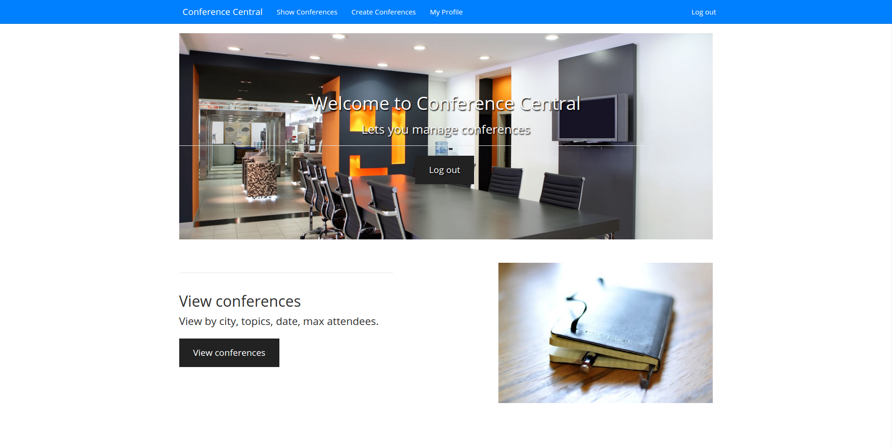

# Conference Organization App

Cloud-based API server that supports a provided conference organization application that exists on the web. The API supports the following functionality found within the app: user authentication, user profiles, conference information and various manners in which to query the data.

| Products | Language | APIs |
| --- | --- | --- |
| [App Engine][1] | [Python][2] | [Google Cloud Endpoints][3] |

## Setup Instructions
1. Update the value of `application` in `app.yaml` to the app ID you
   have registered in the App Engine admin console and would like to use to host
   your instance of this sample.
1. Update the values at the top of `settings.py` to
   reflect the respective client IDs you have registered in the
   [Developer Console][4].
1. Update the value of CLIENT_ID in `static/js/app.js` to the Web client ID
1. (Optional) Mark the configuration files as unchanged as follows:
   `$ git update-index --assume-unchanged app.yaml settings.py static/js/app.js`
1. Run the app with the devserver using `dev_appserver.py DIR`, and ensure it's running by visiting your local server's address (by default [localhost:8080][5].)
1. (Optional) Generate your client library(ies) with [the endpoints tool][6].
1. Deploy your application.

## View the app online

You can view the app online [here](https://conforgapp.appspot.com/).

## View the APIs explorer
1. Visit localhost:8080/_ah/api/exlorer
2. Click conference API to view the endpoints

If you don't see your endpoints click the shield next to the url (Google Chrome) and load the unsafe scripts.

**Update:** You might get an error message if you are trying to access your local APIs explorer using Google Chrome. That is because the APIs Explorer is loaded over HTTPS, but your API when running locally is hosted on HTTP.

[Suggested solution from Google:](https://developers.google.com/explorer-help/#hitting_local_api)
>To resolve this using Chrome, you must start a Chrome session with special flags as follows:
```
[path-to-Chrome] --user-data-dir=test --unsafely-treat-insecure-origin-as-secure=http://localhost:port
```
or a more concrete example:
```
 /usr/bin/google-chrome-stable --user-data-dir=test --unsafely-treat-insecure-origin-as-secure=http://localhost:8080
```
You should only do this for local testing purposes, in which case you can ignore the warning banner displayed in the browser.

#### What were your design choices for session and speaker implementation? (Task 1&2)
The Session class(kind) has the following properties:

1. name: Defined as a StringProperty
2. highlights: I defined this as repeated since a session can have a lot of highlights. Defined as a StringProperty
3. speakers: Also repeated since a session can have multiple speakers
4. duration: The sessions duration. Defined as a TimeProperty
5. typeOfSession: It is defined as a conference's child (StringProperty)
6. date: Defined as a DateProperty
7. startTime: Defined as a TimeProperty

The Speaker class(kind) has only the property **name**.

I've implemented the following endpoints:

1. getConferenceSessions: Returns all sessions
2. getConferenceSessionsByType: Returns all sessions by their type
3. getSessionsBySpeaker: Returns all sessions by their speaker
4. createSession: Creates a new session

Endpoints for wishlist:

1. addSessionToWishlist: A sessions key is used to add a session in a user's wishlist
2. getSessionsInWishlist: Returns a list of sessions in a user's wishlist
3. deleteSessionInWishlist: Removes a session from the user's wishlist

#### Think about other types of queries that would be useful for this application. Describe the purpose of 2 new queries and write the code that would perform them. (Task 3)

I thought that two useful queries would be to query all conferences by their city and all conferences by their topic.

I've implemented the following endpoints:

1. getConferenceByTopic
2. getConferencesByCity

#### Let’s say that you don't like workshops and you don't like sessions after 7pm. How would you handle a query for all non-workshop sessions before 7pm? What is the problem for implementing this query? What ways to solve it did you think of?

This query is using two inequality filters. But since an inequality filter can be applied to at most one property the above query would not work.

A proposed solution would be to create two queries with one filter each and then compine the results.

#### Add a Task (Task 4)
If a speaker has more than 2 sessions then the function **_cacheFeaturedSpeaker** makes that speaker a featured speaker. Then that speaker gets added in the Memcache.

I also implemented the endpoint **getFeaturedSpeaker** which takes in the conference key and returns a list of featured speakers for that conference.

[1]: https://developers.google.com/appengine
[2]: http://python.org
[3]: https://developers.google.com/appengine/docs/python/endpoints/
[4]: https://console.developers.google.com/
[5]: https://localhost:8080/
[6]: https://developers.google.com/appengine/docs/python/endpoints/endpoints_tool
