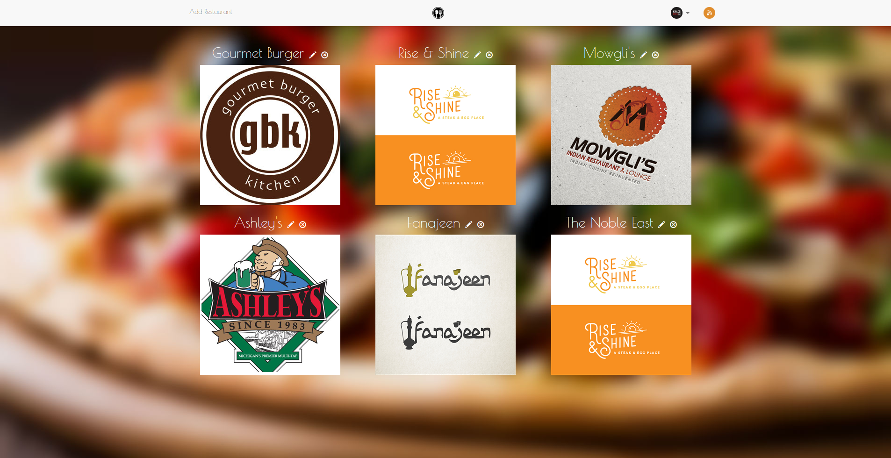

# Item Catalog

Web application that provides a list of items within a variety of categories and integrate third party user registration and authentication (OAuth). Authenticated users have the ability to post, edit, and delete their own items.

The current implementation of the item catalog is a restaurant catalog that provides a list of restaurants and their menus.

## View the app online

You can view the app online [here](https://floating-reaches-7281.herokuapp.com/).

## Run the app in your browser

To run the app in your browser you need install python and virtualenv first or use [Vagrant](https://github.com/kalpetros/projects/tree/master/tournament_results#git-virtualbox--vagrant).

Clone the project folder and cd to the item_catalog app.
```
git clone git@github.com:kalpetros/projects.git
```
Then type:
```
virtualenv venv
```
and activate virtualenv by typing (You must source the virtualenv enviroment for each terminal session where you wish to run your app):
```
source venv/bin/activate
```
Next install the application's dependencies with pip.
```
pip install Flask sqlalchemy oauth2client requests
```
## Set up the database

To create the database type:
```
python setup.py
```
This will create the database **restaurantsdb**.

## Populate the database

To populate the database with a list of restaurants type:
```
python populate.py
```
## Run the server

To run the server type the following:
```
python restaurants.py
```
and visit [0.0.0.0:5000](http://0.0.0.0:5000) or [localhost:5000](http://localhost:5000) in your browser.
