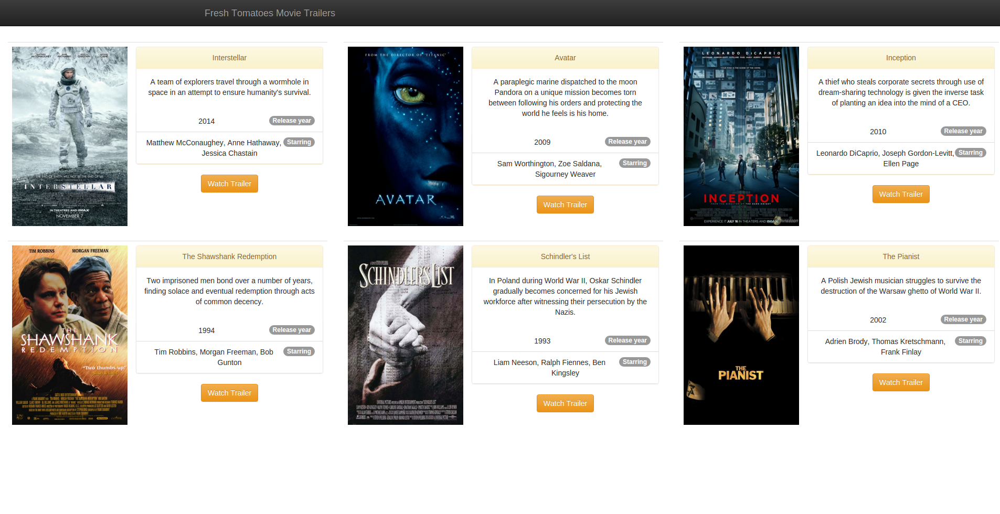

# Movie Trailer Website

written in Python

To run the website
browse in the folder where your files are,
open a terminal and run:

`python entertainment_center.py`

Then your browser will automatically launch and you'll see
the newly generated html file called (fresh_tomatoes.html)
